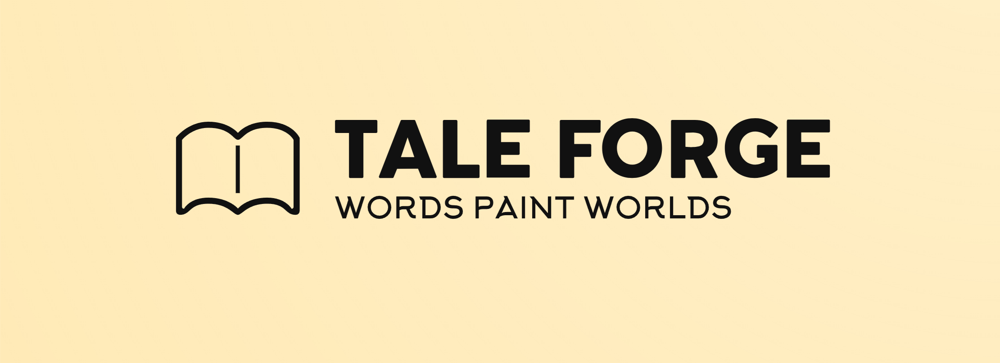
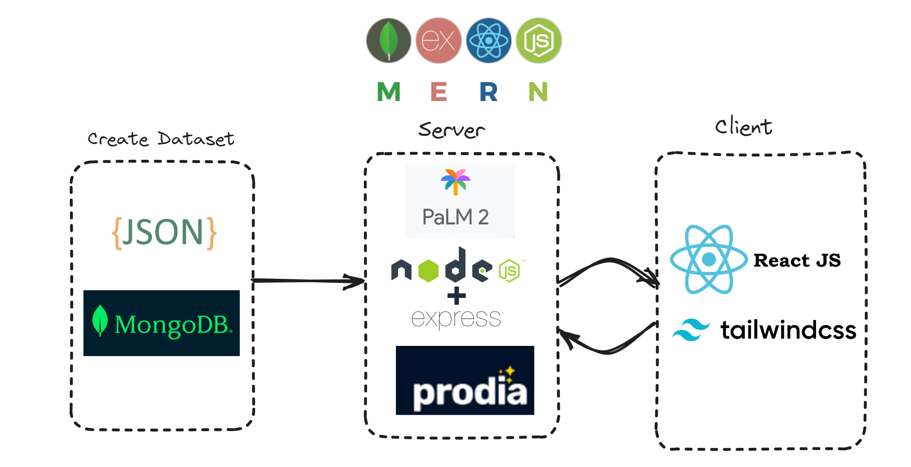
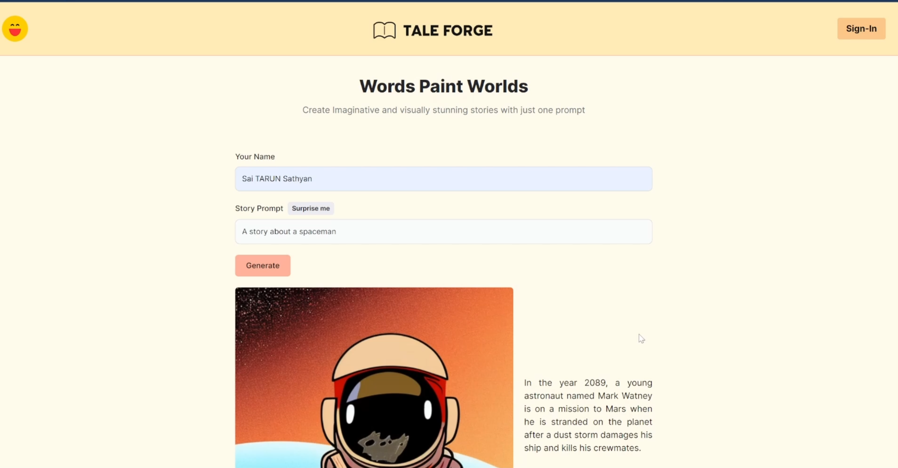
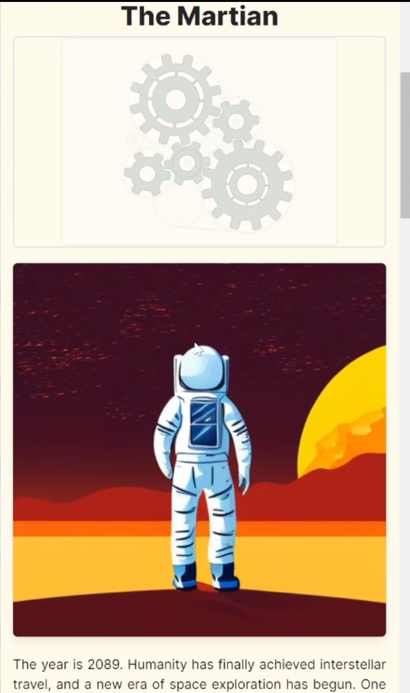

<h1 align="center">

</h1> 

# Trivia Odyssey
Tale Forge was inspired by the universal appeal of storytelling, aiming to make it accessible to all ages with the click of a button. Whether it's crafting bedtime tales for little ones or assisting scriptwriters in shaping initial drafts,. It harnesses the magic of words and visuals, empowering everyone to create captivating narratives effortlessly.

# Webstack Architecture
<h1 align="center">

</h1> 

## 🔑 Key Feature

### One Click Story Generation

### Responsive design

## 🛠 Skills
Vertex AI, Prodia API, express.js , node.js, React , tailwind css 

## 📃 Challenges we ran into
- Understanding vertex ai's api
- Google cloud generative ai usage

## Accomplishments that I'm proud of
- My 1st solo fullstack app build
- Got to explore Image/text generative ai
- Integrating everything into my design

- ## What's next for Trivia Odyssey
- Finish up my sign in using Auth0
- Finish up the share with community page
- Integrate text to speech for the story
- 
